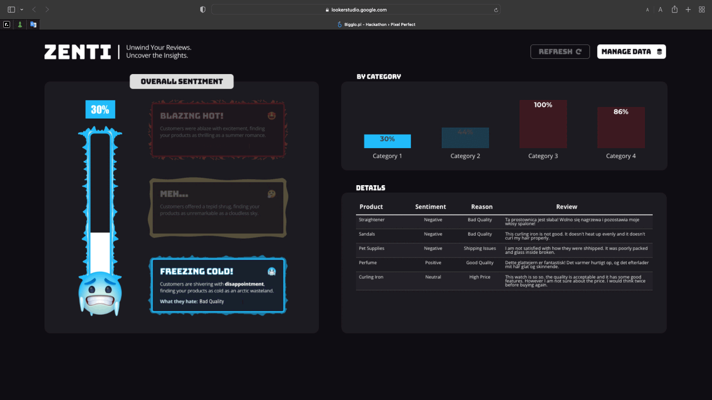

# 📊 ZENTI - Sentiment Analysis - Google Hackathon 2024
This project includes a Google Cloud Function that interacts with Google BigQuery to analyze sentiment and reasons from product reviews. The results are stored in a BigQuery table.

# Looker Visualization
## [ZENTI Looker Dashboard](https://lookerstudio.google.com/u/0/reporting/e0c51a92-f61f-4223-9c37-717941877d10/page/p_xo1b0urjnd/appview)



# 🔍 Overview
### The project consists of a Google Cloud Function:
* `hello_http`: Executes a BigQuery SQL query to analyze sentiment from product reviews and stores the results in a specified BigQuery table.
### Prerequisites
* *Google Cloud Project*: Ensure you have a Google Cloud Project with billing enabled.
* *BigQuery Dataset*: Your project should have the following BigQuery datasets and tables:
  * `reviews` - which is external table of Google Sheet;
  * `Reviews - Wyniki` - table where results are saved;
* *Google Cloud SDK*: Ensure you have the Google Cloud SDK installed and configured.
* *Service Account*: Create a service account in Google Cloud and download the JSON key file.
* *Enable APIs*: Make sure the following APIs are enabled in your Google Cloud project:
  * BigQuery API
  * Cloud Functions API
  * Cloud Build API
# 🔑 Setup 

## Clone repository:
```sh
git clone https://github.com/AJSTO/ZENTI---Google-Hackaton-Project.git
cd your-repo-name
```

## Depedencies:
Ensure that `requirements.txt` have following content:
```txt
functions-framework
google-cloud-bigquery
google-auth
flask
```

## Set up your Google Cloud environment:
* Authenticate with your Google Cloud account:
```sh
gcloud auth login
```
* Set your project ID:
```sh
gcloud config set project YOUR-PROJECT-ID
```
* Create a service account:
```sh
gcloud iam service-accounts create your-service-account-name --display-name "Your Service Account"
```
* Grant roles to the service account:
```sh
gcloud projects add-iam-policy-binding YOUR_PROJECT_ID --member="serviceAccount:your-service-account-name@YOUR_PROJECT_ID.iam.gserviceaccount.com" --role="roles/bigquery.dataEditor"
gcloud projects add-iam-policy-binding YOUR_PROJECT_ID --member="serviceAccount:your-service-account-name@YOUR_PROJECT_ID.iam.gserviceaccount.com" --role="roles/cloudfunctions.invoker"
```
* Create a key for the service account and download it:
```sh
gcloud iam service-accounts keys create ~/key.json --iam-account your-service-account-name@YOUR_PROJECT_ID.iam.gserviceaccount.com
```
## Deployment
* Deploy the Cloud Function:
```sh
gcloud functions deploy hello_http \
  --runtime python310 \
  --trigger-http \
  --allow-unauthenticated \
  --entry-point hello_http
```
* Check the function status:
After deployment, verify the function is running correctly:
```sh
gcloud functions describe hello_http
```
* Usage
Once deployed, the function can be triggered via an HTTP request. Here is a sample CURL command to test the function:
```sh
curl -X GET https://YOUR_REGION-YOUR_PROJECT_ID.cloudfunctions.net/hello_http
```
Replace `YOUR_REGION` and `YOUR_PROJECT_ID` with the appropriate values from your Google Cloud setup.

# 🔎 Function Details
* *Function Name*: hello_http
* *HTTP Method*: GET
* *Description*: Executes a BigQuery query for sentiment analysis and returns the execution status and metrics.
